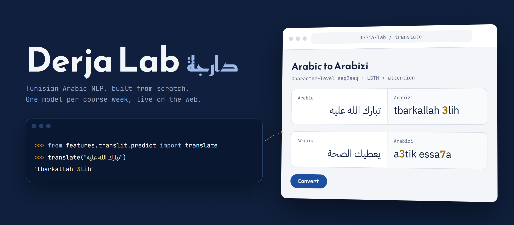

<p align="center">
  
</p>

<p align="center">
  
  
  
  
  
</p>

# Derja Lab

A small web platform for practicing NLP on **Tunisian Arabic (Derja)**. Each feature is a model built from scratch while following an NLP course, then wired into the site.

## Features

| Feature | Status | What it does |
|---|---|---|
| Arabic → Arabizi | Live | Type Derja in Arabic script, get it back in Arabizi (`برشا` → `barcha`) |
| Sentiment analysis | Live | Tell whether a comment is positive or negative, and pick which model judges it |

## Run it

```bash
pip install -r requirements-train.txt   # training needs PyTorch + pandas
python -m features.translit.train       # saves models/translit.pt
python -m features.translit.export      # converts it to models/translit.npz for the site
python -m features.sentiment.train      # saves models/sentiment_<model>.pkl
python app.py                            # site at http://127.0.0.1:7860
```

Run every command from this folder (`Platform/`). The site itself only needs `requirements.txt` (NumPy, scikit-learn, FastAPI): no PyTorch.

## Project structure

```
Platform/
├── app.py                  # FastAPI server: pages + /api/translate, /api/sentiment
├── web/                    # frontend: index, translate, sentiment pages + style.css
├── data/                   # preprocessed_data.jsonl (src, tgt, label)
├── models/                 # translit.pt (training), translit.npz (site), sentiment_*.pkl
└── features/
    ├── sentiment/
    │   ├── preprocess.py   # tokenize(text)
    │   ├── logreg.py       # LogRegSentiment
    │   ├── train.py        # MODELS registry: trains, scores and saves each model
    │   └── predict.py      # loads every sentiment_*.pkl, predict(text, model_id)
    └── translit/
        ├── vocab.py        # character vocab, encode / decode
        ├── model.py        # Encoder, Decoder (attention), Seq2Seq
        ├── train.py        # training loop, saves models/translit.pt (PyTorch)
        ├── export.py       # .pt -> .npz, and checks NumPy output == PyTorch output
        └── predict.py      # NumPy-only inference, translate(text) -> str
```

Every feature lives in its own folder under `features/` and exposes one function (`translate`, `predict`). `app.py` only calls that function.

---

## Notes: Arabic → Arabizi

### Arabizi
Derja written with Latin letters, where digits stand in for Arabic sounds that Latin has no letter for:

| Digit | Letter | Example |
|---|---|---|
| 3 | ع | 3aslema (عسلامة) |
| 7 | ح | 7aja (حاجة) |
| 9 | ق | 9albi (قلبي) |
| 5 | خ | 5obza (خبزة) |
| 2 | ء | imra2a (امرأة) |

There is no standard spelling: `barcha`, `barsha`, `brcha` are all common.

### Why character level
Word-level tokens would treat `barcha`, `baarcha` and `barch2` as three unrelated words. Transliteration is really a mapping between characters, so the model reads and writes one character at a time. The vocab is small (about 64 Arabic and 52 Arabizi characters), and there is no out-of-vocabulary word problem.

### Vocab and special tokens
| Token | ID | Purpose |
|---|---|---|
| `<pad>` | 0 | Fills short sequences so a batch has one length. Ignored by the loss. |
| `<sos>` | 1 | First input to the decoder: "start writing". |
| `<eos>` | 2 | Decoder outputs it to say "done". |
| `<unk>` | 3 | Any character never seen in training (emoji, Latin in the input). |

The vocab is built once in `train.py` and saved **inside the checkpoint**. If it were rebuilt at startup, any change in the data would shift the character IDs and the model would output garbage.

### Seq2seq (encoder / decoder)
- **Encoder:** an LSTM reads the Arabic characters and produces one hidden vector per character, plus a final state that summarizes the sentence.
- **Decoder:** another LSTM starts from that final state and generates Arabizi one character at a time, feeding each prediction back in as the next input.

### Attention
A single final state has to squeeze the whole sentence into one vector, which breaks down on long inputs. With attention, at every step the decoder:
1. Scores each encoder output against its current state (dot product).
2. Turns the scores into weights with softmax. Padding positions are masked out.
3. Takes the weighted sum of encoder outputs, the **context**, which shows where in the Arabic it is "looking".
4. Predicts the next character from `[decoder state, context]`.

That's why the output layer is `Linear(2 * hidden, vocab)`.

### Training
- **Teacher forcing (0.5):** during training, half the time the decoder is fed the *correct* previous character instead of its own guess. This makes early training faster and more stable.
- **Loss:** cross-entropy over characters, ignoring `<pad>`.
- **Gradient clipping (1.0):** stops LSTM gradients from exploding.
- **Validation:** 10% held out, evaluated with teacher forcing **off** so it matches real use. The loss is printed every epoch; the model is saved after the last epoch.

| Setting | Value |
|---|---|
| Embedding size | 128 |
| Hidden size | 256 |
| LSTM layers | 3 |
| Dropout | 0.3 |
| Optimizer | Adam, lr 1e-3 |
| Batch size | 64 |
| Epochs | 60 |

### Inference
**Greedy decoding:** start from `<sos>`, pick the most likely character at each step, and stop at `<eos>` or after 200 characters. It's simple and fast, but it can repeat itself (`3lihelih`). Beam search is the usual fix.

### Serving without PyTorch
PyTorch alone takes ~500 MB of RAM, more than free hosting allows (512 MB). But inference is just matrix math, so `predict.py` redoes the forward pass in NumPy:

```
gates = W_ih · x + b_ih + W_hh · h + b_hh        # 4 gates stacked: input, forget, cell, output
c'    = σ(f) * c + σ(i) * tanh(g)
h'    = σ(o) * tanh(c')
```

That runs through each of the 3 layers, for every character. Then attention and the output layer are a dot product, a softmax and a matrix multiply. `export.py` saves the trained weights to `translit.npz` and checks that NumPy gives exactly the same translations as PyTorch. The server drops from ~680 MB to ~200 MB of RAM.

---

## Notes: Sentiment analysis

### The task
Binary classification: given a comment, predict `positive` (1) or `negative` (0). The labels come from TSAC, and the classes are close to balanced (8,849 positive, 8,205 negative). The split is 80% train and 20% test (`random_state=42`), and every model is scored on the same test set, so their accuracies can be compared directly.

### Choosing a model on the site
Every model is a class with the same four things: `fit(texts, labels)`, `predict_proba(text)`, `score(texts, labels)` and a `vocab` set. `train.py` loops over the `MODELS` registry and saves each one to `models/sentiment_<id>.pkl` with its test accuracy. The site lists whatever is in `models/`, so adding a model takes three steps:

1. Write `features/sentiment/<name>.py` with that interface.
2. Add it to `MODELS` in `train.py`.
3. Run `python -m features.sentiment.train`.

### Logistic regression (86.2% test accuracy)
**Frequency features.** Count how often each word appears in positive and in negative training comments. A comment becomes 2 numbers:

```
x = [ sum of positive counts of its words , sum of negative counts of its words ]
```

`برافو` appears mostly in positive comments, so comments containing it get a big first number.

**Log scaling.** A long comment adds up hundreds of counts, so raw sums reach the tens of thousands and swamp short comments. `log1p(x)` puts them on a comparable scale. This alone took accuracy from 83.9% to 86.2%.

**The model.** Logistic regression learns weights `w` and a bias `b`, and outputs `sigmoid(w · x + b)`, the probability of positive. At 0.5 or above it predicts positive. The confidence shown on the site is `max(p, 1 - p)`.

**Limits.**
- Word order is ignored ("not good" looks like "good" plus "not").
- Words never seen in training add nothing. If a comment has none, the prediction is just the bias, and the site warns you.
- No stemming: Derja spelling varies too much, and the Arabic ISRI stemmer doesn't handle dialect well.

### Bug fixed while porting the notebook
The notebook counted words with `corpus.count(w)`, which counts **substrings**: `من` was also counted inside every longer word containing it. Counting whole tokens with `Counter` fixed it and took accuracy from 72.8% to 83.9%.

---

## Data
About 17,000 Tunisian comments in `data/preprocessed_data.jsonl`, each with Arabic script (`src`), Arabizi (`tgt`) and a sentiment `label` (`pos` / `neg`). The sentiment feature uses the same file.

Data source: [TSAC](https://github.com/fbougares/TSAC), with Arabic-script versions added to go with the Arabizi.
